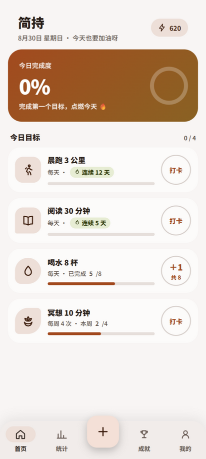
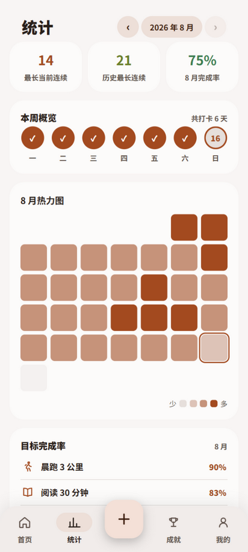
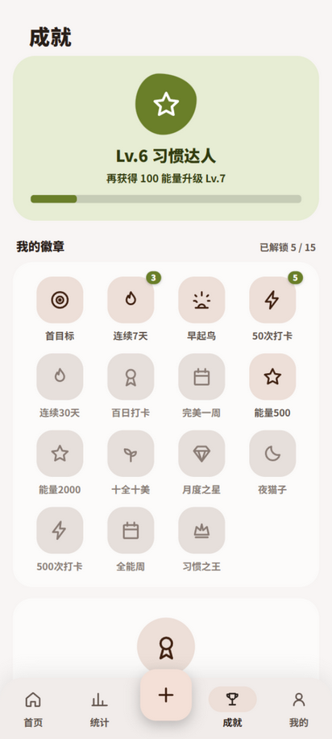

# 简持

一个很简单的习惯打卡应用,纯 HTML / CSS / JavaScript,没有任何框架。

它不讲大道理,也不逼你打卡。每天就看一件事:今天的目标,动了没有。

  
  &nbsp;&nbsp;
  
  &nbsp;&nbsp;
  

## 这个应用用来做什么

给自己定几个小目标——晨跑、阅读、喝水 8 杯、每周冥想 4 次——然后每天动一动手指,记下来。

- 每日目标,今天完成就打卡,连续天数自己会涨。
- 计数型目标(喝水 8 杯)可以一点一点 +1,攒满算达成。
- 每周 / 每月目标,比如"每周冥想 4 次",不用每天都做。
- 打错了可以撤销;目标可以随时改名字、换图标、改周期,或者干脆删掉。

打卡有庆祝弹窗和彩带,能量和等级自己慢慢涨。仅此而已,它不评判你。

## 怎么跑起来

**网页版**:直接双击 `index.html` 就能用,或者部署到任意静态托管(GitHub Pages 也行)。

**Android**:推送到 GitHub 后,Actions 会自动打包 APK
(仓库页 → Actions → Android Build → Artifacts 下载),Android 8.0+ 均可安装,纯离线、无网络权限。

## 功能一览

- **目标**:每日 / 每周 / 每月;计数型目标递增与封顶;编辑、删除(二次确认)
- **统计**:‹ 年月 › 任意切换,热力图点击查看当日明细,周概览,分目标完成率
- **成就**:15 枚徽章,其中 7 类可重复获得(右上角 ×N 次数)
- **外观**:Material You 动态取色(5 种子色)、深色模式、减少动效
- **资料**:自定义名字与头像(头像可自动取名字首字)
- **数据**:导出 / 导入 JSON 备份、清空、重置演示数据

## 隐私

所有数据只保存在你设备本地的 localStorage 里,**不上传任何服务器,也没有任何统计 SDK**。
换设备用导出 / 导入 JSON 搬运。

## 想看懂这个项目

代码刻意只用"基本功":原生 HTML / CSS / JS + 一个极简 Android WebView 壳,没有框架。
每个模块都不长,适合顺着读:

| 文档 | 内容 |
|---|---|
| [docs/architecture.md](docs/architecture.md) | 架构与数据模型:应用是怎么跑起来的 |
| [docs/design/dynamic-color.md](docs/design/dynamic-color.md) | Material You 动态取色的 HSL 数学 |
| [docs/testing-report.md](docs/testing-report.md) | 真实黑盒测试记录:17 组测试点、8 个缺陷与修复 |
| [docs/plans/](docs/plans/) | 功能设计计划(热力图明细、可重复徽章) |
| [docs/changelog.md](docs/changelog.md) | 版本历史 |
| [docs/learning.md](docs/learning.md) | 学习清单:每个知识点对应哪段代码 |

## 后续计划

- [ ] 给领域逻辑(`domain.js`)补纯函数单元测试
- [ ] PWA:Service Worker 离线缓存 + 添加到主屏幕
- [x] 打卡时段记录(已实现:早起鸟 / 夜猫子按当天首次打卡时段判定)
- [ ] 记录完整打卡时刻(几点几分),做打卡习惯统计曲线
- [ ] Web Components 重构目标卡片

## License

[MIT](LICENSE)
